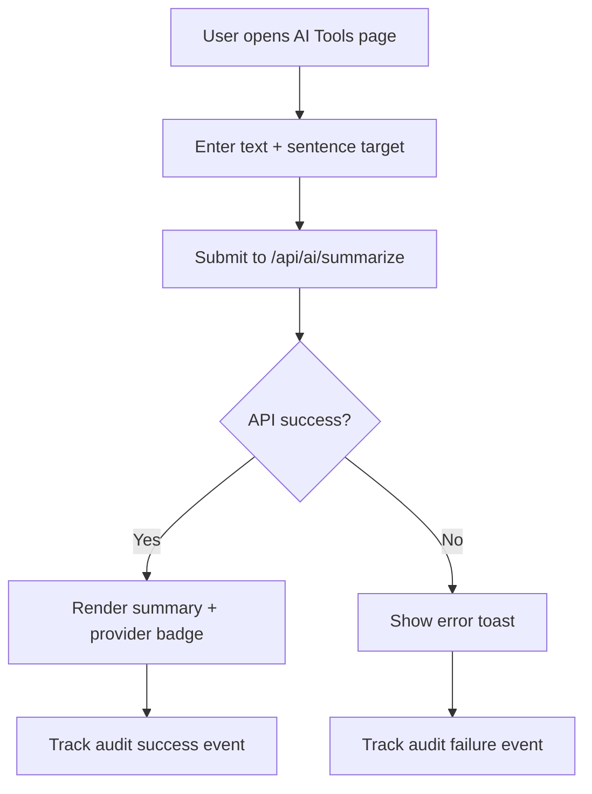

# AI UI Module Documentation

## Scope
Interactive UI workflows for AI-assisted storage features.

Current implementation:
- `SummaryWorkbench.tsx`
  - captures user input,
  - calls `/api/ai/summarize`,
  - displays provider and summary output,
  - emits audit events for success/failure.

Route:
- `/ai-tools` (`app/(dashboard)/ai-tools/page.tsx`)

## Summary Workbench Flowchart

## Next Steps
- Add file-based summarization from selected storage object.
- Add job history and prompt templates.
- Add model controls and cost budget guardrails per organization.
