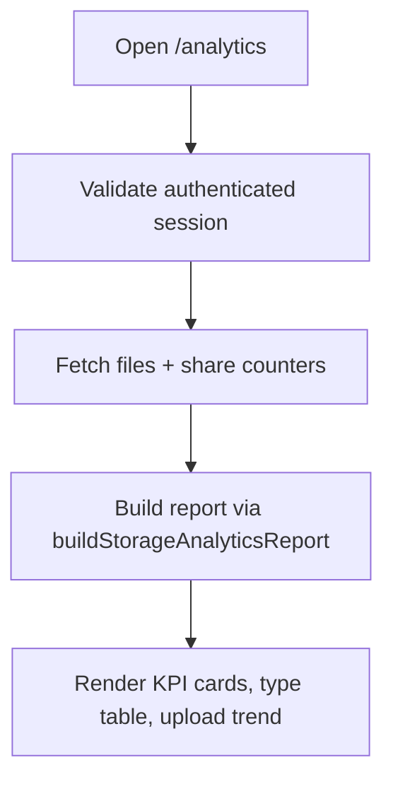

# Analytics Module

## Scope
Storage analytics surfaces account-level visibility for:
- file/folder inventory,
- active vs trashed storage footprint,
- share exposure counts,
- top file-type distribution,
- upload trend snapshots.

## Components
- `StorageAnalyticsOverview.tsx`
  - renders summary KPI cards
  - renders top file-type table
  - renders 30-day upload trend bars

## Route
- `/analytics` (`app/(dashboard)/analytics/page.tsx`)

## Data Sources
- `files` (type/size/folder/trash/created_at)
- `shared_files` (total/public share counts)

## Flowchart

