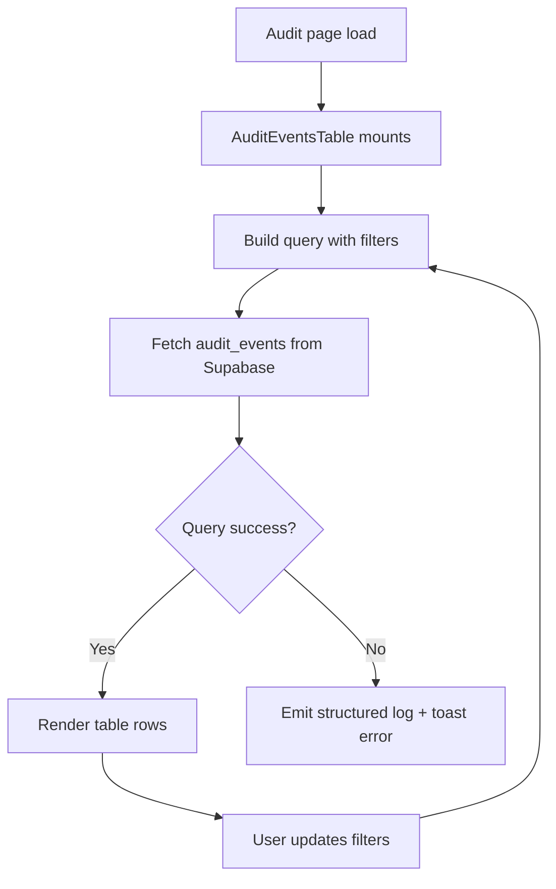

# Audit Module Documentation

## Scope
The audit module surfaces security and activity telemetry for enterprise operators.

Current implementation:
- Fetches recent `audit_events` rows (up to 100)
- Supports client-side filters for:
  - `action`
  - `status`
- Shows event metadata:
  - timestamp,
  - action,
  - status,
  - resource reference,
  - actor identifier

## Files
- `AuditEventsTable.tsx` — main UI table and filter orchestration.

## Data Source
- Supabase table: `public.audit_events`
- RLS constrained by migration policies to authorized actors and team owners.

## Audit UI Flowchart

## Hardening Backlog
- Add server-side pagination and cursor-based navigation.
- Add export (CSV/JSON) and download audit bundles.
- Add filter controls for date range, actor, and team.
- Add dedicated admin policy checks and role-gated views.
