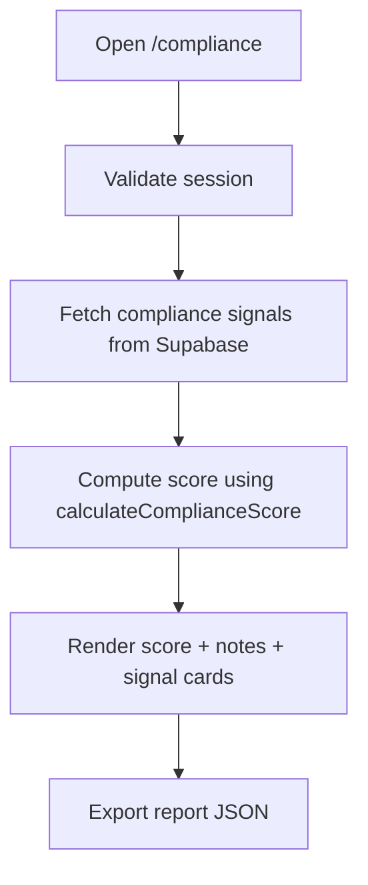

# Compliance Module

## Scope
Enterprise compliance visibility for governance controls and operational risk signals.

## Components
- `ComplianceExportButton.tsx`
  - Client-side export for downloading the generated compliance report JSON.

## Data Inputs
- `storage_policies` (retention + permanent delete setting)
- `audit_events` (7-day failure count)
- `organization_invitations` (pending invite backlog)
- `shared_files` (public link exposure count)

## Flowchart

## Logging & Error Handling
- Server-side structured logs emitted for:
  - missing session,
  - query failures,
  - successful score computation.
- Query errors are logged and the page continues with safe defaults to keep dashboard availability.
