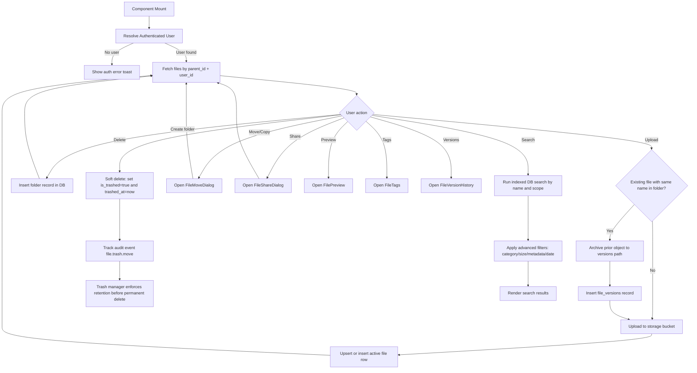

# Files Module Documentation

## Scope
This module powers file and folder management inside the dashboard:
- browsing folders,
- upload (button + drag/drop),
- move/copy/delete actions,
- trash lifecycle (soft delete, restore, permanent delete),
- preview, tags, version history, and share link generation.

## Key Components
- `FileExplorer.tsx` — primary orchestration component.
- `FileMoveDialog.tsx` — destination selection + move/copy operation.
- `FileShareDialog.tsx` — share link creation workflow.
- `FilePreview.tsx` — signed URL preview/download rendering.
- `FileTags.tsx` — tag management dialog.
- `FileVersionHistory.tsx` — historical version operations.
- `FileSearch.tsx` — basic + advanced search UI (scope, category, size, date, metadata text).
- `TrashManager.tsx` — trash listing, restore, and permanent delete workflow.

Associated dashboard views:
- `/shared` — account-owned share links governance table.
- `/favorites` — account favorite file/folder list.
- `/recent` — recent account file/folder activity list.

## Data Ownership Model
- All file list/search operations are scoped by `user_id`.
- Upload and move/copy storage paths are normalized to:
  - `<userId>/<folderId-or-root>/<fileName>`
- Folder records may use `path = null`; file records must carry storage path.
- Overwrite uploads now archive the prior object into:
  - `versions/<fileId>/<version>/<sanitizedFileName>`
  - with matching `file_versions` row for restore/download actions.
- Active explorer/search queries only include `is_trashed = false`.
- Advanced search applies a two-stage pipeline:
  - indexed filters in Supabase query (name, scope, updated date range),
  - deterministic client-side refinement (`lib/files/search.ts`) for category, metadata text, and size ranges.
- Trash page queries only include `is_trashed = true`.
- Soft delete now stamps `trashed_at` to support retention-window enforcement.

## Error and Logging Pattern
- UI errors are surfaced with toast messages.
- Operational details are written using `logger` with `traceId` and scope:
  - `file-explorer`
  - `file-explorer-upload`
  - `file-explorer-fetch`
  - `file-explorer-search`
  - `file-move-dialog`
  - `file-share-dialog`
  - `file-version-history`
  - `file-tags`

## File Explorer Flowchart

## Hardening Backlog (Next Iterations)
- Replace prompt/confirm browser dialogs with controlled modal UX.
- Add server/API authorization checks for mutating operations.
- Enforce stricter share policy controls (domain rules, password policy, expiry policy).
- Add optimistic updates with rollback on failure for better UX.
