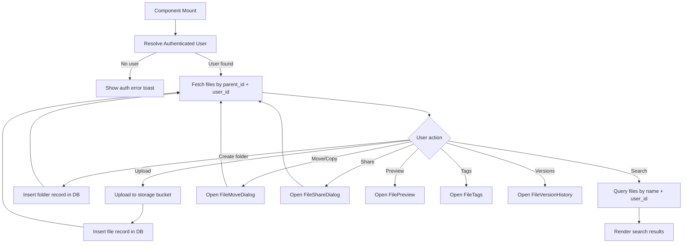

# Files Module Documentation

## Scope
This module powers file and folder management inside the dashboard:
- browsing folders,
- upload (button + drag/drop),
- move/copy/delete actions,
- preview, tags, version history, and share link generation.

## Key Components
- `FileExplorer.tsx` — primary orchestration component.
- `FileMoveDialog.tsx` — destination selection + move/copy operation.
- `FileShareDialog.tsx` — share link creation workflow.
- `FilePreview.tsx` — signed URL preview/download rendering.
- `FileTags.tsx` — tag management dialog.
- `FileVersionHistory.tsx` — historical version operations.
- `FileSearch.tsx` — file/folder search input interactions.

## Data Ownership Model
- All file list/search operations are scoped by `user_id`.
- Upload and move/copy storage paths are normalized to:
  - `<userId>/<folderId-or-root>/<fileName>`
- Folder records may use `path = null`; file records must carry storage path.

## Error and Logging Pattern
- UI errors are surfaced with toast messages.
- Operational details are written using `logger` with `traceId` and scope:
  - `file-explorer`
  - `file-explorer-upload`
  - `file-explorer-fetch`
  - `file-explorer-search`
  - `file-move-dialog`
  - `file-share-dialog`
  - `file-version-history`
  - `file-tags`

## File Explorer Flowchart

## Hardening Backlog (Next Iterations)
- Replace prompt/confirm browser dialogs with controlled modal UX.
- Add server/API authorization checks for mutating operations.
- Enforce stricter share policy controls (domain rules, password policy, expiry policy).
- Add optimistic updates with rollback on failure for better UX.
