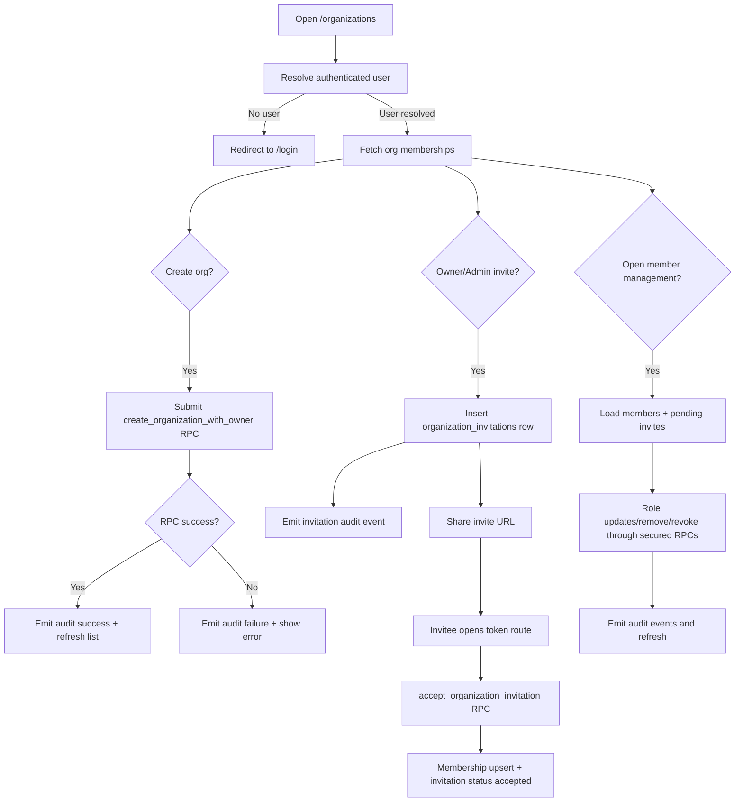

# Organizations Module Documentation

## Scope
This module provides enterprise tenancy entry points:
- creating organizations,
- listing organization memberships for current user,
- invitation management for owner/admin roles.

## Components
- `OrganizationDialog.tsx`
  - creates organization via `create_organization_with_owner` RPC.
  - emits audit events for success/failure.
- `OrganizationList.tsx`
  - fetches memberships via `get_user_organizations`.
  - renders role badges and organization metadata.
- `OrganizationInviteDialog.tsx`
  - creates invitations in `organization_invitations`.
  - captures role + email + token and emits audit events.
  - enforces centralized permission matrix from `lib/authorization/organization-permissions.ts`.
- `OrganizationMembersManager.tsx`
  - loads members via `get_organization_members` RPC.
  - updates roles via `update_organization_member_role` RPC.
  - removes members via `remove_organization_member` RPC.
  - revokes pending invites via `revoke_organization_invitation` RPC.
  - enforces permission matrix in UI before mutation calls.

Route:
- `/organizations` (`app/(dashboard)/organizations/page.tsx`)
- `/organizations/[organizationId]/members` (`app/(dashboard)/organizations/[organizationId]/members/page.tsx`)
- `/organizations/invitations/[token]` (`app/organizations/invitations/[token]/page.tsx`)

## Organization Workflow Flowchart

## Next Steps
- Add role management screen for organization members.
- Add organization-scoped settings and policy controls.
