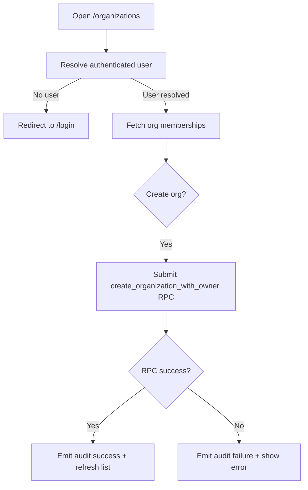

# Organizations Module Documentation

## Scope
This module provides enterprise tenancy entry points:
- creating organizations,
- listing organization memberships for current user.

## Components
- `OrganizationDialog.tsx`
  - creates organization via `create_organization_with_owner` RPC.
  - emits audit events for success/failure.
- `OrganizationList.tsx`
  - fetches memberships via `get_user_organizations`.
  - renders role badges and organization metadata.

Route:
- `/organizations` (`app/(dashboard)/organizations/page.tsx`)

## Organization Workflow Flowchart

## Next Steps
- Add invitation workflow UI tied to `organization_invitations`.
- Add role management screen for organization members.
- Add organization-scoped settings and policy controls.
