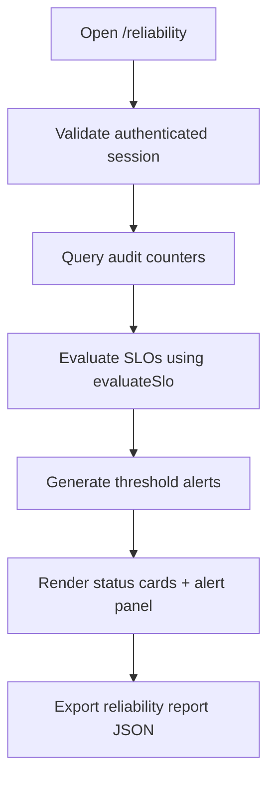

# Reliability Module

## Scope
Operational reliability visibility for critical platform and AI workflows.

## Components
- `ReliabilityExportButton.tsx`
  - Downloads current reliability report snapshot as JSON.

## Route
- `/reliability` (`app/(dashboard)/reliability/page.tsx`)

## Indicators
- Platform SLO (`audit_events` success over 7 days)
- AI summary SLO (`ai.summary.generate` success over 24 hours)
- Alert baseline (`audit_events` threshold checks for failure spikes/rates)

## Workflow Flowchart

## Logging & Error Handling
- Structured logs capture:
  - missing session,
  - partial query failures,
  - successful indicator/alert computation.
- Query failures degrade gracefully to zero-based counters rather than hard failure.
