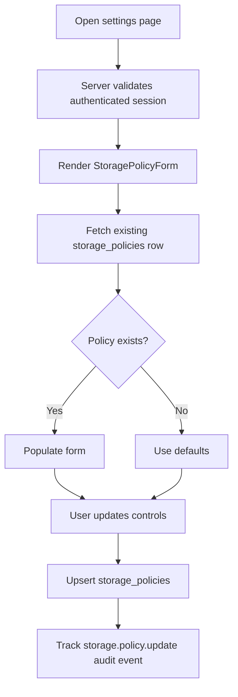

# Settings Module Documentation

## Scope
The settings module introduces governance-focused account controls.

Current implementation:
- Storage retention policy settings
- Permanent delete enable/disable control
- Audit event tracking for policy updates

## Components
- `StoragePolicyForm.tsx`
  - reads user policy from `storage_policies`
  - upserts updates with validation bounds (1..3650 days)
  - emits `storage.policy.update` audit events

Route:
- `/settings` (`app/(dashboard)/settings/page.tsx`)

## Settings Workflow Flowchart

## Next Steps
- Promote policy scope from user-level to organization-level.
- Add legal hold toggle and restricted role controls.
- Add policy history timeline backed by audit events.
