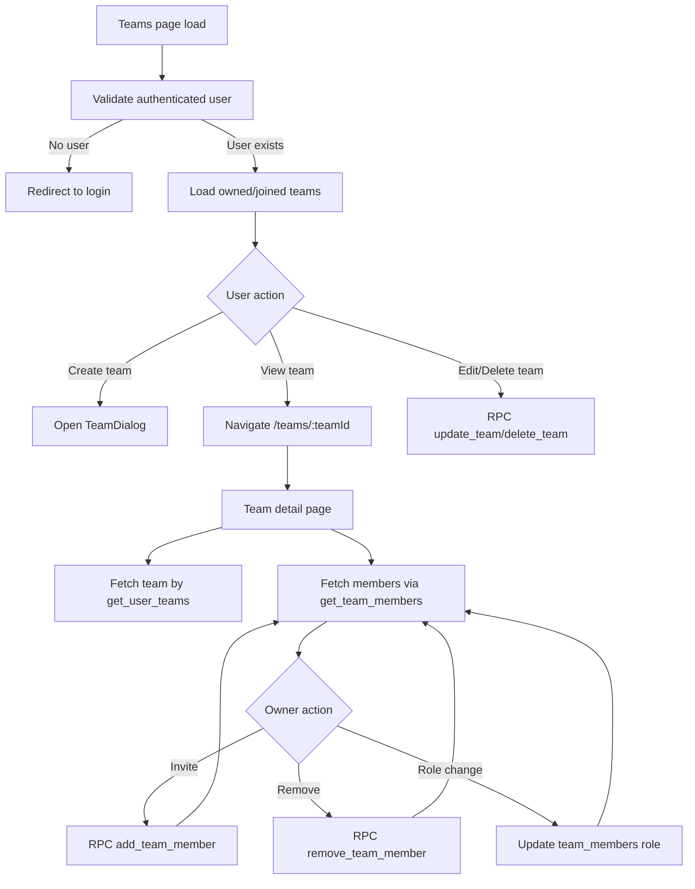

# Teams Module Documentation

## Scope
The teams module provides collaborative workspace management:
- create/update/delete teams,
- list owned and joined teams,
- inspect team members,
- invite/remove members,
- role updates.

## Key Components
- `TeamList.tsx` — list + action cards for owned/joined teams.
- `TeamDialog.tsx` — create/edit team form dialog.
- `MemberList.tsx` — roster table and role/member actions.
- `InviteMemberDialog.tsx` — email-based invitation/add flow.

Related route screens:
- `/teams` (`app/(dashboard)/teams/page.tsx`)
- `/teams/[teamId]` (`app/(dashboard)/teams/[teamId]/page.tsx`)

## Data Access Pattern
- Team data is fetched via RPCs:
  - `get_user_teams`
  - `get_team_members`
  - `create_team_with_owner`
  - `update_team`
  - `delete_team`
  - `add_team_member`
  - `remove_team_member`
- Owner-based controls are enforced in UI before destructive operations.

## Error and Logging Pattern
- Every high-risk action emits structured logs using `logger` with `traceId`.
- User-safe error messages use `getUserErrorMessage`.
- Toast notifications provide success/error feedback for each action.

## Teams Workflow Flowchart

## Hardening Backlog (Next Iterations)
- Replace direct `team_members` role update with dedicated audited RPC.
- Introduce granular permissions beyond owner/member.
- Add invite expiration and approval workflows.
- Add team-scoped audit trail page.
