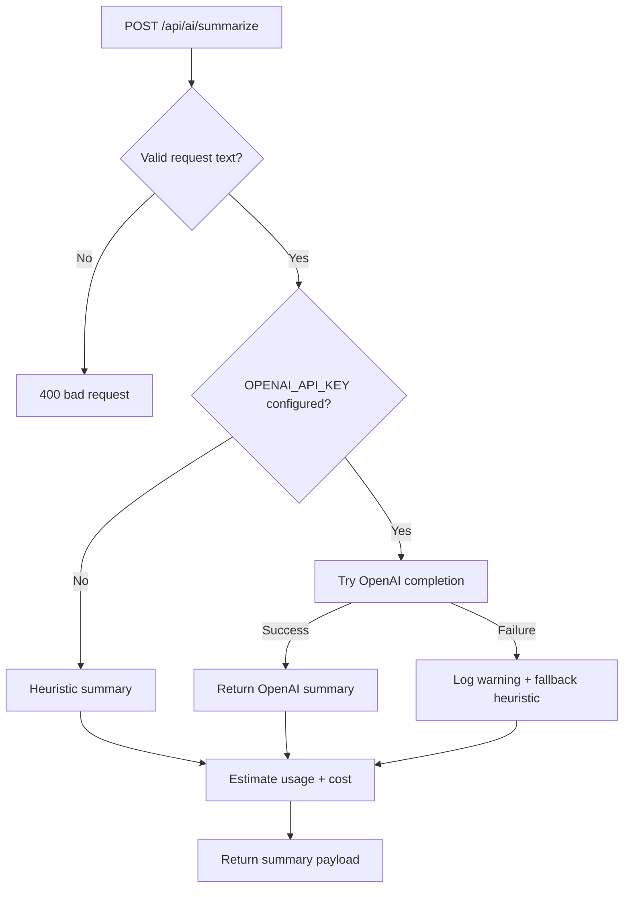

# AI Service Foundation

## Implemented Endpoint
- `POST /api/ai/summarize`

Request body:
```json
{
  "text": "Long content...",
  "maxSentences": 2
}
```

Response:
```json
{
  "summary": "...",
  "provider": "openai | heuristic",
  "maxSentences": 2,
  "usage": {
    "provider": "openai",
    "inputChars": 1200,
    "outputChars": 320,
    "inputTokens": 300,
    "outputTokens": 80,
    "estimatedCostUsd": 0.00009
  }
}
```

## Implemented UI Consumer
- Route: `/ai-tools`
- Component: `SummaryWorkbench`
- Behavior:
  - calls `/api/ai/summarize`,
  - shows provider (`openai` or fallback `heuristic`),
  - writes audit events for success/failure.

## Reliability Strategy
1. Try OpenAI when `OPENAI_API_KEY` is configured.
2. If OpenAI fails, gracefully fallback to deterministic heuristic summarizer.
3. Emit structured logs for both success and fallback/error paths.

## Supporting Utilities
- `lib/ai/summarizer.ts`
  - `summarizeTextHeuristic`
  - `truncateForModel`
- `lib/ai/cost-estimator.ts`
  - token estimation heuristics
  - provider-specific estimated cost envelope

## Test Coverage
- `lib/ai/summarizer.test.ts`
  - sentence extraction behavior
  - empty input handling
  - deterministic truncation behavior
- `lib/ai/cost-estimator.test.ts`
  - token estimate behavior
  - provider cost estimation behavior

## AI Summary Flowchart


## Next Steps
- Add queue-backed async summarization jobs for large files.
- Add tenant-level model and cost controls.
- Persist AI outputs with moderation and retention policy checks.
