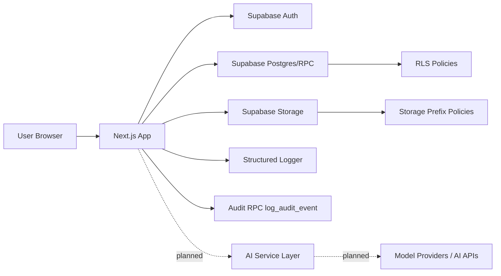

# Cloud Storage Platform Architecture

## Current Architecture (Implemented)

### Runtime stack
- **Frontend**: Next.js (App Router) + React + TypeScript + Tailwind
- **Platform services**: Supabase Auth + Postgres + Storage + RPC
- **Middleware**: session refresh middleware for protected route access
- **Testing**: Jest baseline for utility-layer unit tests

### Current design characteristics
- Route-protected dashboard shell.
- Rich client-side file operations with Supabase-backed persistence.
- Team collaboration module based on RPC functions.
- Structured application logs and non-blocking audit event tracking hooks.

---

## Data and Security Baseline

### Type and schema governance
- Canonical DB type map is maintained in `lib/types/supabase.ts`.
- Legacy duplicate type paths now re-export the canonical type source.

### Security hardening migrations
- `supabase/migrations/20260215_security_baseline.sql`
  - removes temporary broad policies,
  - introduces least-privilege RLS for app tables,
  - enforces storage prefix isolation for user-owned objects.
- `supabase/migrations/20260215_audit_events.sql`
  - introduces `audit_events` table + insert RPC,
  - establishes initial audit visibility and write constraints.
- `supabase/migrations/20260215_organization_foundation.sql`
  - introduces organization, membership, and invitation tables,
  - adds reusable org ownership/admin/member helper functions,
  - establishes initial multi-tenant IAM policy baseline.

---

## Near-Term Target Architecture (Hybrid)

### Why hybrid
The product needs:
1) rapid iteration with Supabase for core CRUD/auth/storage, and
2) dedicated backend services for AI pipelines and enterprise policy orchestration.

### Target components
1. **Next.js Web App**
   - UX, orchestration, client-side interactions, route protection.
2. **Supabase Core Plane**
   - auth, relational data, storage, policy enforcement, audit persistence.
3. **AI/Automation Service Layer (planned)**
   - queue-driven processing, inference orchestration, policy-aware enrichment.
4. **Enterprise Control Plane (planned)**
   - org/RBAC management, compliance/reporting APIs, lifecycle governance.

---

## Request/Control Flow

---

## Architecture Priorities (Active)
1. **Security-first defaults** (least privilege, tenant isolation).
2. **Operational reliability** (tests, explicit error paths, deterministic behavior).
3. **Auditability** (event capture and compliance-friendly data model).
4. **Incremental AI expansion** without destabilizing core storage workflows.