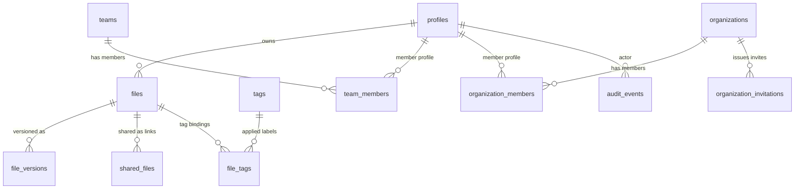

# Database Schema Reference

## Purpose
This document is the canonical database contract summary for the current Supabase-backed platform.
It complements:
- runtime TypeScript schema (`lib/types/supabase.ts`),
- SQL migrations (`supabase/migrations/*.sql`),
- security posture docs (`supabase/SECURITY_BASELINE.md`).

## Design Principles
- **Tenant and owner scoping first**: operational tables carry `user_id`, `owner_id`, `team_id`, or `organization_id`.
- **Soft-delete governance**: `files.is_trashed` + `files.trashed_at`.
- **Auditability by default**: privileged workflows emit immutable `audit_events`.
- **Policy-driven controls**: storage governance and org RBAC decisions are backed by SQL functions and RLS.

## Core Table Domains

### Identity and Account Profile
| Table | Primary Key | Notes |
|---|---|---|
| `profiles` | `id` | Application profile overlay for auth users; stores name/avatar/storage quota counters. |

### Storage and Content Lifecycle
| Table | Primary Key | Notes |
|---|---|---|
| `files` | `id` | File + folder inventory (`is_folder`) with hierarchical `parent_id` and ownership via `user_id`. |
| `file_versions` | `id` | Version snapshots by `file_id` and numeric `version`. |
| `tags` | `id` | User-scoped tags for metadata organization. |
| `file_tags` | `id` | Many-to-many bridge between files and tags. |
| `shared_files` | `id` | Share-link/access envelope with owner, access level, expiry, and download controls. |
| `storage_policies` | `id` | Policy controls for retention and permanent delete constraints. |

### Team and Organization IAM
| Table | Primary Key | Notes |
|---|---|---|
| `teams` | `id` | Team workspace container with `owner_id`. |
| `team_members` | `id` | Team membership and role assignment (`owner/admin/member`). |
| `organizations` | `id` | Enterprise org root entity for cross-team governance. |
| `organization_members` | `id` | Membership and role matrix (`owner/admin/member/viewer`). |
| `organization_invitations` | `id` | Invitation lifecycle (pending/accepted/revoked/expired) with tokenized onboarding. |

### Observability and Compliance
| Table | Primary Key | Notes |
|---|---|---|
| `audit_events` | `id` | Immutable operational/security event stream with actor, action, status, and details payload. |

## Relationship Overview

## Key Constraints and Conventions
- `files.parent_id` establishes folder tree hierarchy.
- `files.path` is storage-object path for non-folder records.
- `files.metadata` is JSON payload for enrichment and advanced search.
- `files.is_trashed` + `files.trashed_at` drive retention windows and purge eligibility.
- `shared_files.owner_id` always records the account that created the share.
- IAM write operations are hardened by SQL RPC permission checks in organization migrations.

## Migration Index
- Team foundation: `20240306_teams_tables.sql`, `20240306_add_description_teams.sql`
- Security and audit baseline: `20260215_security_baseline.sql`, `20260215_audit_events.sql`
- Organization IAM: `20260215_organization_foundation.sql`, `20260215_organization_member_management.sql`, `20260215_organization_invitation_acceptance.sql`
- Storage governance: `20260215_storage_policy_baseline.sql`, `20260215_trash_retention_controls.sql`

## Validation Workflow
1. Apply migrations in staging.
2. Run `supabase/scripts/security_baseline_validation.sql`.
3. Capture artifacts with:
   - `npm run security:evidence ...`
   - `npm run ops:release-ticket ...`
4. Validate JSON artifacts with `npm run ops:validate-json`.
