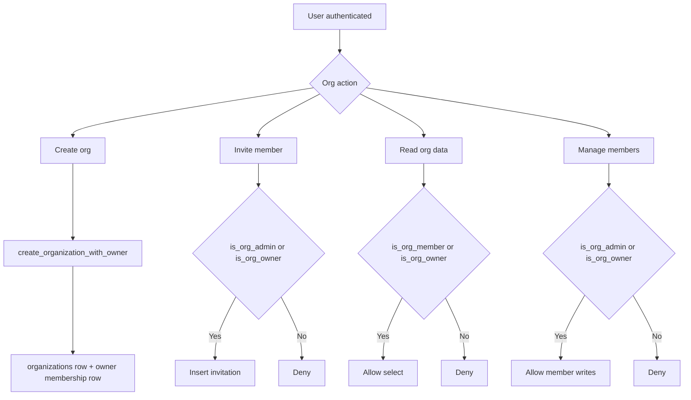

# Organization IAM Foundation

## Purpose
This document defines the baseline multi-tenant identity and access model introduced by:

- `supabase/migrations/20260215_organization_foundation.sql`

It establishes reusable organization primitives for enterprise tenancy.

## New Database Objects

### Tables
- `organizations`
  - tenant root object (`name`, `slug`, `owner_id`)
- `organization_members`
  - membership and role mapping (`owner`, `admin`, `member`, `billing_viewer`)
- `organization_invitations`
  - invitation lifecycle (`pending`, `accepted`, `revoked`)

### Helper functions
- `is_org_owner(org_id, user_id)`
- `is_org_member(org_id, user_id)`
- `is_org_admin(org_id, user_id)`

### RPCs
- `create_organization_with_owner(name, slug, owner_id)`
- `get_user_organizations(user_id)`

## RLS Baseline
- Organization read access for owners and members.
- Organization writes restricted to owner.
- Member and invitation management restricted to owner/admin context.

## IAM Flowchart

## Next Steps
1. Build organization selector and settings UI.
2. Attach files/teams/resources to organization scope.
3. Add policy tests validating cross-org isolation.
4. Introduce SCIM/SSO provisioning pipeline.
