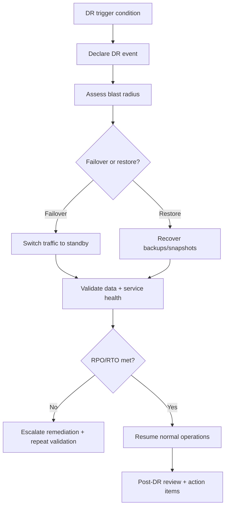

# Disaster Recovery Runbook

## Purpose
Define disaster recovery (DR) actions and validation drills for major outages or data restoration scenarios.

## Recovery Objectives
- **RPO (Recovery Point Objective):** 15 minutes for metadata/audit event persistence.
- **RTO (Recovery Time Objective):** 4 hours for critical dashboard and file operations.

## Trigger Scenarios
- Regional cloud outage impacting primary deployment.
- Data corruption or destructive write event.
- Storage service unavailability beyond SLA tolerance.
- Credential compromise requiring emergency rotation and service restart.

## DR Procedure
1. **Declare DR event**
   - Incident Commander declares DR mode.
   - Freeze non-essential deploys/changes.
2. **Assess blast radius**
   - Identify affected regions/services/tables/buckets.
   - Estimate current RPO gap from last healthy checkpoint.
3. **Restore path selection**
   - **Failover path:** switch to warm standby region.
   - **Restore path:** recover database/storage from backups.
4. **Execute recovery**
   - Restore database snapshot and validate schema integrity.
   - Restore storage object index and critical object sets.
   - Validate auth/session and route accessibility.
5. **Data validation**
   - Compare record counts and checksums for critical tables:
     - `files`
     - `shared_files`
     - `organization_members`
     - `audit_events`
6. **Service validation**
   - Execute smoke checklist:
     - login
     - file list/load
     - upload
     - sharing
     - team/org membership reads
7. **Return to normal operations**
   - Declare recovery complete.
   - Start post-DR review with corrective actions.

## Quarterly Drill Template
- Scenario and assumptions.
- Start/end timestamps.
- Measured RPO/RTO outcome.
- What failed in procedure/tooling.
- Actions to close operational gaps.

## Flowchart

