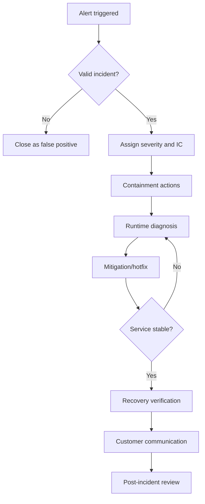

# Incident Response Runbook

## Purpose
Provide a repeatable, auditable response process for production incidents affecting availability, integrity, security, or compliance.

## Severity Levels
| Severity | Definition | Initial Response SLA |
|---|---|---|
| Sev-1 | Full outage, major data risk, or critical security incident | 15 minutes |
| Sev-2 | Major feature degradation with business impact | 30 minutes |
| Sev-3 | Partial degradation/workaround available | 4 hours |
| Sev-4 | Minor issue/no immediate customer impact | Next business day |

## Incident Roles
- **Incident Commander (IC):** Owns end-to-end response and decisioning.
- **Technical Lead:** Coordinates investigation and remediation execution.
- **Comms Lead:** Handles customer/internal updates.
- **Scribe:** Maintains timeline and action log.

## Response Procedure
1. **Acknowledge**
   - Confirm alert validity.
   - Assign initial severity.
   - Open incident channel and response document.
2. **Contain**
   - Apply immediate risk reduction controls (feature flag, access revoke, throttling).
   - Preserve forensic evidence (logs, traces, query snapshots).
3. **Diagnose**
   - Gather runtime evidence from logs/metrics/traces.
   - Form hypotheses and verify quickly.
4. **Mitigate**
   - Deploy low-risk hotfix/workaround.
   - Validate customer impact reduction.
5. **Recover**
   - Confirm service health, SLO trend recovery, and data integrity.
6. **Communicate**
   - Send updates at fixed cadence:
     - Sev-1: every 30 min
     - Sev-2: hourly
     - Sev-3/4: as needed
7. **Close and Review**
   - Publish final timeline, root cause, and corrective actions.
   - Track follow-up action items to completion.

## Evidence Checklist
- Affected services/routes and blast radius.
- Runtime log extracts (with trace IDs).
- Query/API failure rate deltas.
- Before/after validation proof of fix.
- User communication history.

## Post-Incident Review Requirements
- Root cause category (code/config/dependency/process/security).
- Why safeguards did not prevent/detect earlier.
- Permanent prevention actions with owners and due dates.
- Test/monitoring additions required to avoid recurrence.

## Flowchart

