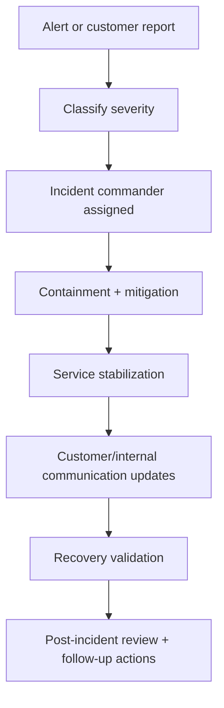

# Operations Runbooks

## Scope
This module captures operational response procedures for reliability and compliance-sensitive incidents.

## Runbooks
- `INCIDENT_RESPONSE_RUNBOOK.md`
  - Severity classification
  - Triage and containment
  - Communication protocol
  - Recovery and post-incident review
- `DISASTER_RECOVERY_RUNBOOK.md`
  - Recovery Point Objective (RPO) / Recovery Time Objective (RTO)
  - Backup/restore verification workflow
  - Regional outage response drill template

## Alerting Inputs
- Reliability alert baseline uses audit-event thresholds from:
  - `app/(dashboard)/reliability/page.tsx`
  - `lib/reliability/alerts.ts`
- Threshold status should be reviewed during incident triage and weekly ops review.

## Operations Flowchart

