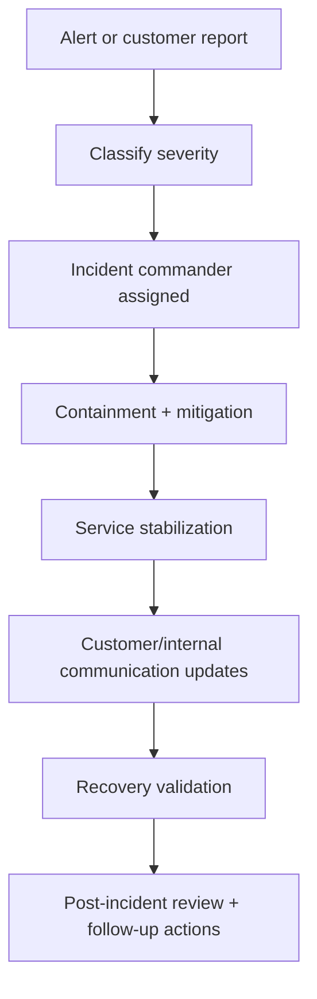

# Operations Runbooks

## Scope
This module captures operational response procedures for reliability and compliance-sensitive incidents.

## Runbooks
- `INCIDENT_RESPONSE_RUNBOOK.md`
  - Severity classification
  - Triage and containment
  - Communication protocol
  - Recovery and post-incident review
- `DISASTER_RECOVERY_RUNBOOK.md`
  - Recovery Point Objective (RPO) / Recovery Time Objective (RTO)
  - Backup/restore verification workflow
  - Regional outage response drill template

- `SIEM_INTEGRATION.md`
  - API polling model for reliability alerts.
  - Routing guidance for warning/critical alert severities.
- `RELEASE_VALIDATION_TEMPLATE.md`
  - release-ticket checklist for security, reliability, and operational evidence capture.
- `EVIDENCE_PACK_CHECKLIST.md`
  - consolidated artifact checklist for security, readiness, and release-governance evidence.

## Alerting Inputs
- Reliability alert baseline uses audit-event thresholds from:
  - `app/(dashboard)/reliability/page.tsx`
  - `lib/reliability/alerts.ts`
  - `app/api/reliability/alerts/route.ts`
- Threshold status should be reviewed during incident triage and weekly ops review.

## Health & Probes
- Health endpoint:
  - `GET /api/health`
  - reference: `docs/API_HEALTH.md`
- Use for deployment smoke probes and uptime checks.
- Probe automation script:
  - `npm run ops:probe -- --base-url https://<app-host> --scope global --reliability-token <token>`

## Related API Docs
- `docs/API_RELIABILITY_ALERTS.md`
- `docs/API_HEALTH.md`

## Security Validation Automation
- Evidence generator script:
  - `supabase/scripts/generate_security_validation_evidence.mjs`
- npm shortcut:
  - `npm run security:evidence -- --environment staging --validator ... --approver ... --ticket ...`
- Runbook:
  - `supabase/SECURITY_VALIDATION_RUNBOOK.md`

## Operations Flowchart

