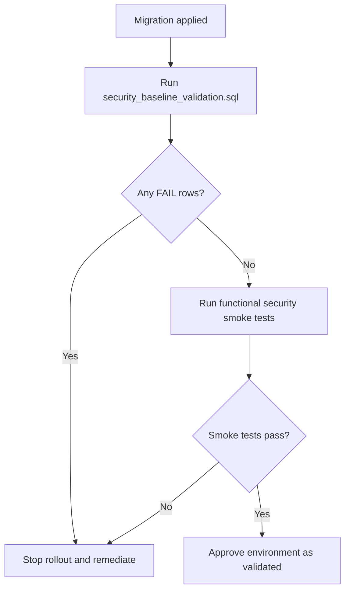

# Security Baseline Validation Runbook

## Purpose
Operationalize security migration validation for staging and production before/after rollout windows.

## Artifacts
- Migration baseline:
  - `migrations/20260215_security_baseline.sql`
  - `migrations/20260215_audit_events.sql`
  - `migrations/20260215_organization_foundation.sql`
  - `migrations/20260215_organization_member_management.sql`
  - `migrations/20260215_organization_invitation_acceptance.sql`
- Validation script:
  - `scripts/security_baseline_validation.sql`

## Environments
- **Staging** (mandatory before production)
- **Production** (low-traffic maintenance window)

## Pre-Validation Checklist
1. Confirm migrations are applied in target environment.
2. Confirm backup snapshot completed and restorable.
3. Confirm incident response on-call is aware of rollout window.

## Execution Steps
1. Open Supabase SQL editor (or `psql`) on target environment.
2. Execute:
   - `supabase/scripts/security_baseline_validation.sql`
3. Record output in rollout ticket:
   - RLS state table
   - helper function PASS/FAIL
   - forbidden policy PASS/FAIL
   - storage prefix policy presence
4. If any FAIL appears:
   - stop rollout,
   - open Sev-2 engineering incident,
   - remediate and rerun validation script.

## Post-Validation Functional Smoke
Run authenticated smoke checks with at least two test users:
- User A can only read/write own `files`.
- User B cannot access User A file paths or DB rows.
- Shared file access works only for intended recipient/public link rules.
- Team and organization member operations respect role boundaries.
- Audit events written for security-sensitive actions.

## Rollback Criteria
Trigger rollback if:
- RLS unexpectedly disabled on critical table.
- Forbidden temporary policy is present.
- Cross-user data access observed during smoke validation.

## Evidence Retention
Attach to release ticket:
- SQL validation output screenshots/logs.
- Smoke test evidence.
- Final go/no-go decision and approver.

## Validation Flowchart

